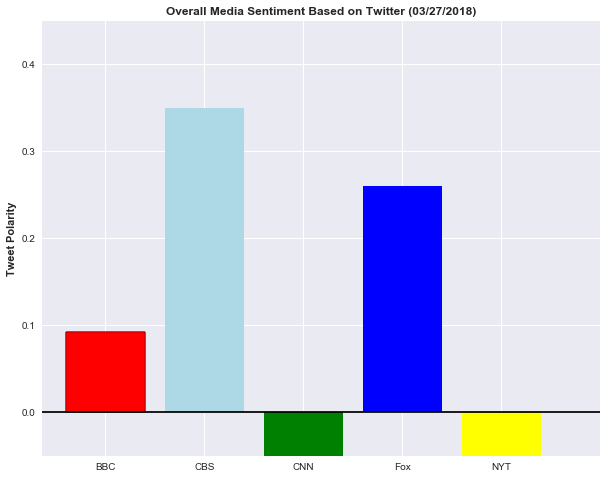

```python
# Dependencies
import tweepy
import json
import numpy as np
import matplotlib.pyplot as plt
import pandas as pd
import seaborn as sns
from vaderSentiment.vaderSentiment import SentimentIntensityAnalyzer
analyzer = SentimentIntensityAnalyzer()
import time
```


```python
consumer_key = "BADfHZM86ux3BGq6OzQFAzeSz"
consumer_secret = "9KMYSluWvDYFlqRwW8cAM15yGwjqdmjrCNUu0PSXjWz65bDVPg"
access_token = "3142538747-HSx7wYLXiuny6WiYTJTuOE8ZgNii20AaVVZMjFa"
access_token_secret = "v2qTZ7noTAREKruem3PwxemxKtCOGd6GsYZovRSQOZOVi"
```


```python
# Setup Tweepy API Authentication
auth = tweepy.OAuthHandler(consumer_key, consumer_secret)
auth.set_access_token(access_token, access_token_secret)
api = tweepy.API(auth, parser=tweepy.parsers.JSONParser())
```


```python
# Target Search Term
news_outlet = ["@BBC", "@CBS", "@CNN", "@Fox", "@NYTimes"]
counter = 1
sentiments =[]
```


```python
for outlet in news_outlet:
    public_tweets = api.user_timeline(outlet, count=100)
    tweetnumber = 1
    print(outlet)
    for tweet in public_tweets:
        print("Tweet %s: %s" % (counter, tweet["text"]))
        compound = analyzer.polarity_scores(tweet["text"])["compound"]
        pos = analyzer.polarity_scores(tweet["text"])["pos"]
        neu = analyzer.polarity_scores(tweet["text"])["neu"]
        neg = analyzer.polarity_scores(tweet["text"])["neg"]
        tweets_ago = tweetnumber
        sentiments.append({"Media Source": outlet,
                           "Text":tweet["text"],
                           "Date": tweet["created_at"],
                           "Compound": compound,
                           "Positive": pos,
                           "Neutral": neu,
                           "Negative": neg,
                           "Tweet Count": tweetnumber})
        tweetnumber = tweetnumber + 1
        counter = counter + 1


```

    @BBC
    Tweet 1: The ancient Greeks thought a life of ‘constant leisure’ was the highest life you could live. https://t.co/sascCq8iks
    Tweet 2: There's over 50 classic cookery shows being served up on @BBCiPlayer this #EasterWeekend. 
    👉 https://t.co/CKECZMGmx8 https://t.co/j3RfAYQvTI
    Tweet 3: 🎭 @MargotRobbie is planning a new TV series, which will give Shakespeare plays a 'female perspective'.
    👉… https://t.co/pTLXfve0ds
    Tweet 4: 🚀🌎 'Mad' Mike Hughes flew his home-made rocket to try and 'prove' the earth is flat. 
    
    🚨 SPOILER: it's not.  https://t.co/f5oNRItwyq
    Tweet 5: RT @BBCTwo: Now we've got our country back... what actually is it? 🤔
    
    #CunkOnBritain starts Tuesday 3 April, 10pm, @BBCTwo. @missdianemorga…
    Tweet 6: RT @BBCBreakfast: A team of abseilers have been roped in to give Cheddar Gorge in Somerset an extreme spring clean. https://t.co/iYmkiizeRi
    Tweet 7: RT @BBCR1: We can't get enough of @george_ezra's Live Lounge 😍
    
    Watch him perform 'Paradise' and cover 'These Days' right here 👉https://t.c…
    Tweet 8: RT @bbcgetinspired: Check out @JesseLingard and some of his @PremierLeague mates showing us their super moves. 🕺🏻 
    
    Show us yours with #sup…
    Tweet 9: When this woman visited an uninhabited Caribbean island, the last thing she expected was to find it covered in plas… https://t.co/cpKW9tl61v
    Tweet 10: About 700,000 people in the UK are on the autism spectrum, with five times as many males as females being diagnosed… https://t.co/PXJMuG76Tn
    Tweet 11: The number of children living in relative poverty in the UK has risen to 4.1m. 
    
    This is the story of Tyler, one of… https://t.co/xFtEAjBTXC
    Tweet 12: Filmed in Nottingham during the worst winter for the NHS on record, groundbreaking series #Hospital returns tonight… https://t.co/PVSIcvCGc9
    Tweet 13: Tonight, George Alagiah explores the fascinating history of Queen Elizabeth II and her beloved Commonwealth. 
    
    The… https://t.co/xXer4FRyTq
    Tweet 14: 🐶😂 It was a Dachsh(und) to the finish line. https://t.co/7VvkU5GfUg
    Tweet 15: ✈️ Joy and Mary flew WW2 planes before any navigation system was installed.
    #RAFat100 https://t.co/yxNMblfTEf
    Tweet 16: Tom Cruise stars in a remake of the 1953 adaptation of HG Wells’s classic novel. 🍿
    
    War of the Worlds | @BBCiPlayer… https://t.co/h19JvTlFSA
    Tweet 17: In her role as head of the Commonwealth, the Queen embarked on her first tour of the nations in 1953.
    
    But by 1970… https://t.co/Av61bahNZF
    Tweet 18: Never let a squirrel nibble your nobble... 🎈🐿😱
    https://t.co/cHm9m6At3m
    Tweet 19: Apple wants to introduce new emojis to better represent people with disabilities. ❤️️ https://t.co/CcJfojmtTa https://t.co/ZRdEhVPMEm
    Tweet 20: A crack that opened up in Kenya’s Rift Valley, damaging a section of the Narok-Nairobi highway, is still growing... https://t.co/T5YocDauYj
    Tweet 21: From hot cross bun gin to Creme Egg Yorkshire pudding, this year’s Easter treats are bigger, weirder and more decad… https://t.co/HvDJmgcB5q
    Tweet 22: RT @bbcpress: Sue Perkins will return to host the 2018 #BAFTA TV awards on Sunday 13 May on @BBCOne. https://t.co/pieSWNAGbH
    Tweet 23: 😂 @BillBailey is NOT a fan of taramasalata. #Room101 
    
    https://t.co/soAAz27c0C
    Tweet 24: The kiwi bird's egg is so large, it takes almost ten days to lay! 🐦🥚😳  #DavidAttenboroughsNaturalCuriosities
    https://t.co/AkZqK9vzZZ
    Tweet 25: 🤔Why do so many celebrities decide to enter politics?
    
    Some have done so more successfully than others...… https://t.co/MkEDpSeLMJ
    Tweet 26: Wishing you could get out of bed just that little bit earlier? 😴
    
    If you need some motivation to set that alarm, he… https://t.co/zsisa2oA4s
    Tweet 27: Could this be an answer to global water shortages? 🏜💧 This machine creates water out of thin air. 
    
    https://t.co/caz4nXMJg5
    Tweet 28: Tonight, @regyates meets people whose lives have been devastated by the Grenfell fire. 
    
    Reggie Yates: Searching fo… https://t.co/HPgtcZuHte
    Tweet 29: Tonight, @mcgregor_ewan and @McgColin celebrate the centenary of the Royal Air Force. 
    
    RAF at 100 with Ewan and Co… https://t.co/nF2iwBP51b
    Tweet 30: The first ever statue of David Bowie has been unveiled in the town where he debuted Ziggy Stardust. ⚡️… https://t.co/lFgROYVkv1
    Tweet 31: When you're enjoying being single and people just can't deal with it. 🙄😂 @kathbum #LiveAtTheApollo 
    
    https://t.co/byHMHWyhPq
    Tweet 32: 🇺🇸🏝🇬🇧 Welcome to Tangier Island, the tiny US island where people speak with a British accent.… https://t.co/1RoM285gRJ
    Tweet 33: 💬 We could listen to him speak all day. 
    
    📽 Sir David Attenborough's voice was just as iconic in the 60s as it is t… https://t.co/zYi3oK5C13
    Tweet 34: Predictions suggest a build-up of about 80,000 tonnes of plastic in the Pacific Ocean is growing rapidly. ♻️🌊💔… https://t.co/uKD9BQWmUi
    Tweet 35: 👽✨🛸 @prattprattpratt stars as a happy-go-lucky hero who joins forces with an unlikely group of aliens. 
    
    Guardians… https://t.co/B9W7kRZ1Qz
    Tweet 36: Weighing just 100g, a newborn panda is one 900th the size of its mum! 🐼💕 #DavidAttenboroughsNaturalCuriosities https://t.co/nKLQh03DJs
    Tweet 37: 🐟Meet SoFi - the soft robot fish developed by MIT to swim among real fish in coral reefs and around the ocean to he… https://t.co/HDa7q7WsHf
    Tweet 38: Ever wondered what made you feel moody? It might be your gut.
    
    👉 https://t.co/l8oMv5gPN2 https://t.co/vq2yhtBOAn
    Tweet 39: RT @BBCScotland: Up your brunch game with perfect poached eggs.
    
    via @bbcthesocial https://t.co/1imXNeOZ9d
    Tweet 40: RT @bbcweather: #Winter may not be done with us yet, as colder continental air fights back against milder maritime air across the UK this w…
    Tweet 41: RT @BBCSport: A simply astonishing confession from Australia captain Steve Smith and batsman Cameron Bancroft 😳 https://t.co/YaE7fBZamq
    Tweet 42: A woman who drinks 30 cans a day says her addiction to energy drinks is worse than gambling.… https://t.co/d11ATW0F0f
    Tweet 43: You learn something new every day. Here's how to poo a baby jaguar. 🤷💩#BigCatsAboutTheHouse https://t.co/Eg5rF1414b
    Tweet 44: When the clocks have gone forward but there's no way you're getting out of bed yet. 🙅‍♂️⏰#DaylightSavings https://t.co/cHBPV3ITsQ
    Tweet 45: "I still see people screaming for help."
    
    This Sunday at 9pm on @BBCTwo, @REGYATES meets the people whose lives wer… https://t.co/RS16yXF17H
    Tweet 46: The story of the last decade of Picasso's life, through the words of family and friends. 🎨
    
    Picasso's Last Stand |… https://t.co/RyiuI8KgSk
    Tweet 47: "Beauty is your inside, it's your personality and what shines from beneath." 
    
    25-year-old rapper Paigey Cakey had… https://t.co/CVGr69Y0oO
    Tweet 48: Cambridge have won the men's and women's Boat Races. https://t.co/COTzXYuo4N 🏆 🚣 #BoatRace2018 https://t.co/6SQjF1ToSt
    Tweet 49: 📺😂 @RomeshRanga is NOT a fan of Gogglebox. #LiveAtTheApollo
    https://t.co/FHm9g6Emss
    Tweet 50: When proposals go wrong... 😳💍 #Doodlebugs 
    https://t.co/8Yi6giWO3S
    Tweet 51: Writer Sara Maitland has lived alone in rural Scotland for 20 years. 
    
    Here are seven valuable life lessons we can… https://t.co/2eAqUlnwuA
    Tweet 52: 🤳How an Instagram video lost me my dream job in fashion: https://t.co/72yWgHdc1k https://t.co/fl3DxMcIL5
    Tweet 53: 🚣 @clarebalding is live from the River Thames as @UniofOxford and @Cambridge_Uni  meet for one of the most iconic e… https://t.co/Ls9rtIYov4
    Tweet 54: RT @bbcthree: The barber helping men with dementia relive their younger lives. https://t.co/p8axQVK836
    Tweet 55: Which animals are likely to become extinct in your lifetime? 🦏💔
    https://t.co/9KwlmcNrWV
    Tweet 56: Don't miss the highlights from the Gymnastics World Cup! 🤸🤸‍♀️🇬🇧
    
    World Cup Gymnastics | @BBCOne | 2:05pm |… https://t.co/7mpufyeEMo
    Tweet 57: How much do you know about horses? Take this quiz to see if you are an equestrian expert…🐴
    
    https://t.co/ChGCB9Xi1W https://t.co/P9UgJ99nsx
    Tweet 58: Meet Hester, the 10-year-old visually impaired skier who's hoping for Paralympic gold one day. ⛷🥇https://t.co/6aiUaTc3yS
    Tweet 59: "The enthusiastic viewer should feel he is almost the man on the spot!" 
    
    In 1949, the BBC announced it would telev… https://t.co/WEoPpkrW1V
    Tweet 60: RT @BBCNewsNI: Prince Harry and Meghan Markle are visiting Northern Ireland https://t.co/ODxLd1LIr8 https://t.co/s0zPTXj3Tk
    Tweet 61: RT @bbcf1: Lewis Hamilton took the first pole of the season in spectacular style ⚡️
    
    https://t.co/a7YDOx0FlQ
    Tweet 62: RT @sportrelief: A humongous THANK YOU to everyone who has taken part, fund-raised &amp; watched over the past weeks &amp; tonight. The #SportRelie…
    Tweet 63: RT @sportrelief: The nation has joined together for this year's #SportRelief pulling out all the stops to make their steps count. Well done…
    Tweet 64: 🥑A Cultural history of the avocado: https://t.co/jo1UyWlVw7 https://t.co/7VF6pBpG57
    Tweet 65: Meet Alexandre, one of the only male performers of ‘baladi’ – also known as belly dancing – in the Middle East. 🎶
    
     https://t.co/K12N1Y6PU7
    Tweet 66: RT @BBCOne: .@GaryLineker, @OreOduba, @ThisisDavina &amp; more kick off the biggest ever night of #SportRelief now on @bbcone. @sportrelief 
    Fo…
    Tweet 67: From @taylorswift13 to @Beyonce: these are the secretive musicians who avoid interviews. 🎤🤐 https://t.co/nqOmaVMzoo https://t.co/sbDga7L5cp
    Tweet 68: Tonight, @GaryLineker, @ThisisDavina and @OreOduba kick off the biggest ever night of @sportrelief! ️⚽️✨🚴🎉… https://t.co/tgbpC76heP
    Tweet 69: Your week, as told by @louistheroux. 📆😂
    https://t.co/Ae6bDBpIBW
    Tweet 70: RT @BBCWales: A #DanceForParkinsons session with @ndcwales for @GetCreativeUK in #Cardiff this week 
    
    Find out what’s happening on the fina…
    Tweet 71: Meet Australian maths teacher Eddie Woo, who has won fans worldwide with his high-energy lessons, posted on YouTube… https://t.co/vTfNDZzA3b
    Tweet 72: RT @BBCOne: No @andy_murray, this is not a dream. @GeriHalliwell really IS in your bedroom making you sing Spice Girls songs 🎤
    
    @sportrelie…
    Tweet 73: These beautiful photographs reveal how refugees in Tyneside have turned to the healing powers of gardening. 🌿📸… https://t.co/2gq0t9FnIR
    Tweet 74: How would you react if you woke up and found Michael McIntyre and Peppa Pig in your bedroom? 
    
    Poor @AndyMurray…
    
    S… https://t.co/7ZP0hUYeKr
    Tweet 75: Spring is here! 🌱🌸🥦 Make the most of seasonal ingredients with these delicious soup recipes. https://t.co/fXp7eJXoJc https://t.co/hA1b2bdSrd
    Tweet 76: Want to get creative this weekend? Here's how to make a hooky rug. 
    #MakeCraftBritain 
    https://t.co/uqibyP09s7
    Tweet 77: RT @BBCSport: He was one of English football's first black players and the British Army's first ever black officer to command white troops.…
    Tweet 78: RT @BBCRadio2: 👻 “I thought the script was really frightening and original.” Martin Freeman chats to @achrisevans about his creepy new film…
    Tweet 79: RT @BBCTwo: Our entire weekend plans. 😴👇 #BigCatsAboutTheHouse https://t.co/vl0zUcCdmI
    Tweet 80: RT @sportrelief: It looks like #TeamGryffindor are storming ahead in the #HogwartsLeague in the #SportRelief app. 
    
    #TeamHufflepuff, #TeamS…
    Tweet 81: ☕️🍰Some blueberry muffins sold by cafes and supermarkets contain more than the recommended daily intake of sugar fo… https://t.co/9bh6K8aMH2
    Tweet 82: Friday night is CELEBRITY FIGHT NIGHT! 🥊🥊
    
    Who'll be victorious? Tune in to #SportRelief to find out!
    
    https://t.co/9ZhgNGmxOD
    Tweet 83: Scrolling through headlines, the world can feel like a pretty dark place. So here are nine reasons to be happy. 😊 🎉… https://t.co/KrNoB0qaqC
    Tweet 84: Would you want secret helpers like these to help you out in nerve-wracking situations? #TheSecretHelpers 
    https://t.co/ua2X4vxKR3
    Tweet 85: Meet the first polar bear cub to be born in the UK in 25 years. 😍
    https://t.co/njq1r6eONE
    Tweet 86: RT @BBCOne: All hail queen Kat! 🙌👑 
    
    #EastEnders @BBCEastenders https://t.co/PLmAc53L6t
    Tweet 87: Istanbul's Blue Mosque looks spectacular. @wmarybeard looks at the art, meaning and significance of calligraphy the… https://t.co/Mv3voUkcvc
    Tweet 88: 🖋 The artist reimagining Islamic calligraphy for the 21st Century: https://t.co/wgbVwZLDEa #Civilisations https://t.co/nxW6Sokjdn
    Tweet 89: In 1918, the very first signs of the Spanish Flu pandemic were kept under wraps. So how did the deadly illness get… https://t.co/zuZryXLihL
    Tweet 90: Go behind-the-scenes at @TheBigCatSanct where expert Giles Clark is hand-rearing a jaguar cub. 🐾… https://t.co/0hDQP6X1wA
    Tweet 91: Tai chi has been recommended to help people with the chronic pain condition fibromyalgia. 
    
    https://t.co/uYDlKfWbt7 https://t.co/Y7P9ceP82j
    Tweet 92: The cost of living alone, rather than living as a couple, is more than £1000 a year. 💔🏠
    
    This is the price of being… https://t.co/udzI9xGci6
    Tweet 93: .@ManUtd have applied to have a professional women's team. ⚽️ https://t.co/rxzdRsDhUd https://t.co/meO65NRCtm
    Tweet 94: Worried about your impact on the planet? 🌍💚
    
    This is how to make your next holiday more eco-friendly. ♻️🌴
    
    👉… https://t.co/wCmDZJledV
    Tweet 95: Think twice before you throw your kitchen waste in the bin! Here's how to grow plants from kitchen scraps. 🥕🥔🍎
    
    👉… https://t.co/MMgrC8yseG
    Tweet 96: RT @mixital: 🗡️New #DoctorWho writing challenge!🗡️
    Write a story featuring Rory Williams! Share it with us here: https://t.co/zW42ZnvJnc
    
    #…
    Tweet 97: Could you name the disaster that killed the most people in the last 100 years?
    
    Contagion! The BBC Four Pandemic |… https://t.co/10zHfD8PHT
    Tweet 98: 🎶Some musicians love doing them, others don’t.
    
    Seven secretive musicians who like to avoid interviews:… https://t.co/7Rm55Ddynj
    Tweet 99: RT @BBCEarth: Today is #WorldWaterDay. This teen has an ingenious way to test the safety of water around the world 
    @BBC_Future https://t.c…
    Tweet 100: Has @chrishughes_22 read any of his own book? 😂🤦
    
    Here's what he confessed when he took on @BBCR1's fake lie detect… https://t.co/tVaKesbKQ1
    @CBS
    Tweet 101: RT @ACMawards: The ACM for New Vocal Group of the Year goes to @MidlandOfficial! And yes, that really was @Reba on the phone! #ACMawards ht…
    Tweet 102: RT @ACMawards: In case you didn’t know, the ACM for New Male Vocalist of the Year goes to @BrettYoungMusic. Check out his reaction when @Re…
    Tweet 103: RT @ACMawards: Over the weekend @Reba called the ACM New Artist of the Year winners to let them know they had won! Let’s just say our New F…
    Tweet 104: Congratulations to the 53rd #ACMawards New Artist winners @Lauren_Alaina, @MidlandOfficial, and @BrettYoungMusic! W… https://t.co/Fr8H4arwGj
    Tweet 105: New start times in East/Central Time Zones #60Minutes 7:35ET/6:35CT #Instinct  8:35ET/7:35CT #NCISLA 9:35ET/8:35CT… https://t.co/8W5hAeLrvs
    Tweet 106: Don’t miss a minute of the action. Stream the Elite Eight® games LIVE today starting at 2PM ET with a FREE trial of… https://t.co/8NwU8HdiHR
    Tweet 107: RT @MomCBS: That's a wrap on the #Mom panel at #PaleyFest! Thanks for following along! https://t.co/we4JgqPt6P
    Tweet 108: RT @MomCBS: A fan just commented that #Mom helped bring him out of a deep depression. 💜💜💜 #PaleyFest
    Tweet 109: RT @MomCBS: "Go out for it anyway. If you're good for the role, you're good for the role." @theJaimePressly's advice for aspiring actors wi…
    Tweet 110: RT @MomCBS: Mom Co-Creator @GemmaRBaker just pointed out her own #Mom in the audience at #PaleyFest! 💜
    Tweet 111: RT @MomCBS: "I'm not someone in recovery who goes to AA, but I have taken so much away from it...to take one day at a time." - @theJaimePre…
    Tweet 112: RT @MomCBS: "You get to appreciate working with such talented people." - @AnnaKFaris #Mom #PaleyFest
    Tweet 113: RT @MomCBS: “I love this job. I love working with these women. I love working in front of the live audience… It’s alive and it’s fun.” - @A…
    Tweet 114: Get on your feet for @Jason_Aldean, @ThomasRhett, @ChrisStapleton, @KeithUrban, and @ChrisYoungMusic, the five nomi… https://t.co/oT5ogjdj4x
    Tweet 115: Get ready for some sweet games! Stream #5 Clemson vs #1 Kansas LIVE at 7PM ET and #11 Syracuse vs #2 Duke LIVE at 9… https://t.co/4WstgrKNnW
    Tweet 116: RT @SEALTeamCBS: In honor of #NationalPuppyDay... 😍 #SEALTeam https://t.co/4mIZPpiRlU
    Tweet 117: RT @HawaiiFive0CBS: Nothing like a man and his dog! 😍🐶 Happy #NationalPuppyDay to Eddie, the best pup on the Five-0 Task Force! #H50 https:…
    Tweet 118: Game on! 16 teams left and the race to the finish continues tonight. Stream #11 Loyola-Chicago vs #7 Nevada LIVE at… https://t.co/W374rmzzoC
    Tweet 119: Save the date! These are season finales you do NOT want to miss. RT if you're excited! https://t.co/UUQoWsPPSh https://t.co/cDl4WmxMtU
    Tweet 120: Congratulations to all of the @CBSDaytime nominees for the #DaytimeEmmys! See the full list of #DaytimeEmmy nominee… https://t.co/ivJVJWvfsf
    Tweet 121: Female Vocalist Of The Year nominee @MarenMorris will show her fans how it’s done when she takes the stage to showc… https://t.co/PITjmAoFT8
    Tweet 122: The legendary @Reba returns to host the 53rd #ACMawards and she’s proving just how comfortable she is behind the mi… https://t.co/XPXcSPRXqC
    Tweet 123: RT @nancyodell: Told my daughter I'd be presenting at @ACMawards again this year. (Woot woot!We both luv country music!)She took this pic o…
    Tweet 124: RT @ladyantebellum: Ecstatic to announce we'll be performing at the #ACMawards in Las Vegas again this year! https://t.co/Qfhs94j6FR
    Tweet 125: Country superstars @kennychesney, @ladyantebellum, @blakeshelton, and @KeithUrban have just been added to the stell… https://t.co/bJ4If7MacP
    Tweet 126: RT @YandR_CBS: Forever evolving, Forever inspiring, Forever Young and Restless. ❤️ Get ready to celebrate 45 years of #YR starting in just…
    Tweet 127: New start times in East/Central Time Zones: #60Minutes 7:37ET/6:37CT #Instinct series premiere 8:37ET/7:37CT… https://t.co/xT3YKqmu2M
    Tweet 128: Spend your Sunday streaming Second Round games LIVE with a FREE trial of CBS All Access! https://t.co/3P85rXLy4b https://t.co/zbWfirD9Ju
    Tweet 129: RT @instinctcbs: TONIGHT, Dr. Dylan Reinhart rewrites the book on abnormal behavior. Don't miss the premiere of #Instinct at 8/7c! https://…
    Tweet 130: If any duo knows how to rock the stage, it's @FLAGALine. The Vocal Duo Of The Year nominee will perform live at the… https://t.co/FknabB8NQp
    Tweet 131: How is your bracket looking after last night? Stream Second Round games LIVE today with a FREE trial of CBS All Acc… https://t.co/25JlIpgwog
    Tweet 132: Where better to spend #StPatricksDay than the place everybody knows your name? It’s just your luck that every singl… https://t.co/Fom5wmdENL
    Tweet 133: Stars @JakeMcDorman and Nik Dodani will join the cast in the upcoming revival of Murphy Brown coming to CBS.… https://t.co/JCAx29lo0i
    Tweet 134: RT @thegoodfight: Go behind the scenes with costume designer @DanLawsonStyle in "Behind The Style," a new weekly video series all about the…
    Tweet 135: The games have just begun! Continue to stream First Round games LIVE today with a FREE trial of CBS All Access:… https://t.co/YTGsJ48zYP
    Tweet 136: RT @TheTalkCBS: You asked, we answered! The fun never ends when the ladies #KeepTalking and answer your fan questions 🗣💬➡️ https://t.co/ie1…
    Tweet 137: RT @instinctcbs: Dr. Dylan Reinhart is lured back into the field from his life of quiet academia when a certain serial killer makes things…
    Tweet 138: Stream First Round games LIVE today starting at 12PM ET with a FREE trial of CBS All Access! https://t.co/3P85rXLy4b https://t.co/vZow3YD8cb
    Tweet 139: RT @CBSSports: It's the most wonderful time of the year. #MarchMadness https://t.co/e4c9qohqSR
    Tweet 140: Give these ladies some love! @Lauren_Alaina, @DBradbery, @carlypearce, and @RaeLynn are nominated for New Female Vo… https://t.co/IVhwURfJ3S
    Tweet 141: RT @ManWithAPlan: Hungry for more #ManWithAPlan bloopers and behind-the-scenes videos featuring cast like @matt_leblanc, @thelizasnyder, @k…
    Tweet 142: Music stars @MileyCyrus, @edsheeran, @ladygaga, and more will honor the legendary @eltonofficial and his hit songs… https://t.co/UzxARCCLnI
    Tweet 143: RT @thegoodfight: The verdict is in. The new season of #TheGoodFight is 🔥🔥🔥! Stream it now on CBS All Access: https://t.co/FkYSNSXlRb https…
    Tweet 144: RT @MadamSecretary: In less than an hour, #MadamSecretary's Keith Carradine will be taking over the @MadamSecretary Twitter page! Tweet alo…
    Tweet 145: RT @DierksBentley: Take and post a photo of the woman in your life who inspires you daily! Use the hashtag #WomanAmenACM in your post for a…
    Tweet 146: RT @MomCBS: If you missed guest star @KChenoweth in the latest episode of #Mom, not to worry! Watch now: https://t.co/RlvXoGOZ0l https://t.…
    Tweet 147: Give a round of applause to @KelseaBallerini, @MirandaLambert, @Reba, @MarenMorris, and @CarrieUnderwood, the five… https://t.co/Ncp1BTXx6N
    Tweet 148: RT @thegoodfight: Smart, sexy, and sophisticated. See what's coming this season on #TheGoodFight. https://t.co/CuKhx2G50P https://t.co/ygTI…
    Tweet 149: RT @BlueBloods_CBS: Even stand-up guys fall down sometimes. #BlueBloods is new tonight at 10/9c! https://t.co/UOlDm22wWW
    Tweet 150: Today and every day we celebrate the women in our lives who empower and inspire us. Share a story about an influent… https://t.co/9rVtqrElvT
    Tweet 151: Take and post a photo of the woman in your life who inspires you daily! Use the hashtag #WomanAmenACM in your post… https://t.co/7ShhvE48zy
    Tweet 152: RT @thegoodfight: Meticulously constructed. Soapy &amp; sexy. Intoxicating, savage television. 🔥 Here's what critics are saying about #TheGoodF…
    Tweet 153: This just in! @Jason_Aldean, @mirandalambert, @LukeBryanOnline, and many more are set to perform at the 53rd Academ… https://t.co/mfxw2VxzU4
    Tweet 154: Meet the ensemble of talented actors slated to join $1, a new mystery series coming to CBS All Access:… https://t.co/QoyYv7vxwg
    Tweet 155: Will @Jason_Aldean, @garthbrooks, @LukeBryanOnline, @ChrisStapleton, or @KeithUrban be named Entertainer Of The Yea… https://t.co/rMD8zjeX3s
    Tweet 156: RT @thegoodfight: It feels good to be back. 👠💄🔥 The season 2 premiere of #TheGoodFight is now streaming, exclusively on CBS All Access: htt…
    Tweet 157: RT @thegoodfight: Tomorrow, #TheGoodFight is back. Stream the season 2 premiere only on CBS All Access: https://t.co/tNFR8LBJO2 https://t.c…
    Tweet 158: Who are the trailblazing women in your life that inspire you? Join CBS and the ANA's #SeeHer initiative, celebratin… https://t.co/M0KqZ41Bes
    Tweet 159: Join @maria_bello, @aishatyler and @TeaLeoni in celebrating the accomplishments of women who have contributed to th… https://t.co/MefESBeFL3
    Tweet 160: In honor of Women's History Month, CBS and the Association of National Advertisers' (ANA) #SeeHer initiative will p… https://t.co/2wtYxKJVuO
    Tweet 161: RT @ZoeListerJones: Tonight’s an all new Life In Pieces and it’s directed by my ride or die @nataliaanderson!!!… https://t.co/2LPfmyLWrY
    Tweet 162: RT @MarenMorris: Hot damn! Woke up from my post-wisdom teeth haze to find out I’m up for 4 @ACMawards ! So honored, especially for the Dear…
    Tweet 163: RT @KelseaBallerini: Ohhhhh goodness. Incredible. Thank you thank you thank you. #female https://t.co/1ZTYjNfQeF
    Tweet 164: RT @KeithUrban: ACMs...... HOLY SMOKES!!!!! MAD LOVE TO U ALL THIS MORNING  FOR THESE INCREDIBLE NOMINATIONS. I’M EXTREMELY GRATEFUL!!!!!!!…
    Tweet 165: RT @ACMawards: Congratulations to this year’s #ACMawards Video of the Year nominees:
    “Black” - @DierksBentley
    “It Ain’t My Fault” - @Brothe…
    Tweet 166: RT @ACMawards: Please give a round of applause to this year’s #ACMawards Entertainer of the Year nominees: @Jason_Aldean, @GarthBrooks, @Lu…
    Tweet 167: .@ChrisStapleton, @ThomasRhett, @mirandalambert and more are all nominated for awards at Country Music's Party of t… https://t.co/Vm1vXRUDYJ
    Tweet 168: The Queen of Country, @Reba, is returning to host the 53rd #ACMawards on Sunday, April 15 at 8/7c. Here are a few o… https://t.co/Iqzz6Gql01
    Tweet 169: RT @survivorcbs: It’s time! #Survivor https://t.co/YPk6cGWrUA
    Tweet 170: RT @CBSThisMorning: TOMORROW: The nominees for the 2018 @ACMawards will be announced live by the one-and-only, @Reba! 
    
    Watch on @CBS in ou…
    Tweet 171: RT @thegoodfight: From the set design and costumes to hair and makeup, the production quality is truly next-level. Take a peek inside the u…
    Tweet 172: RT @LivinBiblically: The fun continues on Facebook! The #LivingBiblically cast is live to talk about tonight’s premiere. Tune in here: http…
    Tweet 173: RT @KevinCanWaitCBS: Can you get all the way through these #KevinCanWait bloopers without laughing?! @KevinJames,@LeahRemini and the rest o…
    Tweet 174: RT @ACMawards: That’s right! @Reba is headed to @CBSThisMorning on Thursday, March 1 to announce this year’s #ACMAwards' nominees. Tune in…
    Tweet 175: RT @ScorpionCBS: You can't hack your way to a 197 IQ, but you are well on your way with these Genius Facts from #TeamScorpion! 💻 You can be…
    Tweet 176: RT @SuperiorDonuts: You can always count on @DavidKoechner for a laugh! Did your favorite Tush moment make the list? Catch a new #SuperiorD…
    Tweet 177: RT @TheTalkCBS: TODAY: We loved them together then &amp; we love seeing them together now! Welcome back to the show @THESaraGilbert​'s good fri…
    Tweet 178: RT @thegoodfight: As foundations begin to crumble, our characters struggle to make sense of this new dystopian world. The cast teases what'…
    Tweet 179: #LivingBiblically's @linzkraft and @jrfergjr appeared on @KCBS's Facebook Live this morning, talking all about what… https://t.co/4RebcHuuMQ
    Tweet 180: RT @CBSSports: Introducing CBS Sports HQ, a New 24/7 Direct-to-Consumer Streaming Network for Sports News, Highlights, &amp; Analysis.
    
    Stream…
    Tweet 181: RT @CBSBigBrother: It’s down to the final 5 celebrity Houseguests, and anyone could take home the grand prize! Tune in NOW to watch the #BB…
    Tweet 182: RT @startrekcbs: Binge the entire first season of #StarTrekDiscovery. All episodes now streaming exclusively on CBS All Access: https://t.c…
    Tweet 183: RT @thegoodfight: #TheGoodFight returns in 1 week. Season 2 premieres Sunday, March 4. https://t.co/nomCao1GWp https://t.co/BOn6bOe9Tb
    Tweet 184: RT @thegoodfight: This is our new favorite thing. Christine Baranski debuted #TheGoodFight the Musical on @colbertlateshow last night! 🎵🎤…
    Tweet 185: RT @LivinBiblically: Confession time: have YOU ever hit the "close door" button in an elevator while somebody was approaching? The cast of…
    Tweet 186: RT @CBSEyeSpeak: Mark your calendars! #CBSEyeSpeak kicks off March 14 with The EYE Speak Summit. Follow our page for more details! https://…
    Tweet 187: RT @CBSEyeSpeak: Proud to announce a new CBS initiative, promoting female empowerment and developing the next generation of leaders through…
    Tweet 188: RT @LivinBiblically: When you're living by the Bible, it's good to have a priest and a rabbi on call (provided they answer their phones, th…
    Tweet 189: RT @thegoodfight: Chicago lawyers are being hunted and the world is going insane. 
    
    The new season of #TheGoodFight premieres Sunday, March…
    Tweet 190: Ready for some larger than life competition? This new series from @MarkBurnettTV will premiere in summer 2018.… https://t.co/gDXHLdIJ5v
    Tweet 191: With tournament dreams on the line, make sure to stream these college basketball matchups on CBS All Access:… https://t.co/SGkYUZrQWB
    Tweet 192: RT @LivinBiblically: While Chip's sticking to the Bible's original rules, the cast of #LivingBiblically has given them a more modern makeov…
    Tweet 193: Casting News! Peter Mark Kendall, Michael Gaston, Greg Wise, Rade Šerbedžija, Zack Pearlman, and Keye Chen join the… https://t.co/GFob2KrD8H
    Tweet 194: RT @BullCBS: The verdict is in...#Bull is the perfect Valentine! ❤️ Happy #ValentinesDay! https://t.co/poEejI4AnC
    Tweet 195: RT @NoActivityCBS: Car 27 reporting: Season 2 of #NoActivity coming soon!
    
    Binge season one now on CBS All Access: https://t.co/yvxoQMeyhN…
    Tweet 196: RT @LivinBiblically: Against all odds (and the advice of his God Squad), Chip is determined to live life by the Good Book. Think you could…
    Tweet 197: RT @thegoodfight: Christine Baranski reflects upon the spectacular metamorphosis of her character in #TheGoodFight's first season. Revisit…
    Tweet 198: RT @startrekcbs: Binge the entire first season of #StarTrekDiscovery. All 15 episodes now streaming on CBS All Access: https://t.co/lKLaptP…
    Tweet 199: RT @SuperiorDonuts: Looking for a #Valentine? Tush is here to help you land your dream date just in time for the day of love! #SuperiorDonu…
    Tweet 200: RT @CBSBigBrother: The pressure is on as the Houseguests battle each other for victory in the first HOH competition. Stream the season prem…
    @CNN
    Tweet 201: Why would Kim Jong Un make a secret trip to China? https://t.co/fLriLREnPK https://t.co/GGqkwHg9dv
    Tweet 202: Germany has a far-right enemy within, writes Paul Hockenos for @CNNOpinion https://t.co/taphGDaAVM https://t.co/dBQm5cxRsZ
    Tweet 203: Water park executives charged in 10-year-old's death https://t.co/g4YxddzT9Y https://t.co/f4QN75CO3U
    Tweet 204: Facebook CEO Mark Zuckerberg won't appear before UK lawmakers https://t.co/8fEYaECWKg https://t.co/E6AZ2LnRB5
    Tweet 205: "Going into Rio I was in the best physical shape of my entire life. ... and that meant nothing because mentally I w… https://t.co/YPVhYQ99R0
    Tweet 206: Is President Trump's silence on Russian President Vladimir Putin and porn star Stormy Daniels telling?… https://t.co/1kidsp6e4g
    Tweet 207: Paris police treat murder of Holocaust survivor as anti-Semitic attack https://t.co/6PCyVCPdpS https://t.co/cuz3T6LiKQ
    Tweet 208: Here are 5 things you need to know today https://t.co/qRZURBA66J https://t.co/JByDGZBHYI
    Tweet 209: Photographer Gregor Sailer explores the haunting artifice of fake villages around the world https://t.co/cu4bLm50sI https://t.co/61ssTTUZTy
    Tweet 210: Fact-checking Tucker Carlson on diversity in America https://t.co/7S7y05oOBX | Analysis by Ronald Brownstein https://t.co/GZVSCDATFz
    Tweet 211: Arizona has suspended Uber's self-driving car tests in the state following a fatal crash involving one of the compa… https://t.co/d3y4VVxlno
    Tweet 212: A fire that tore through a shopping center killing at least 64 people, including many children, was caused by "crim… https://t.co/bmW36iQrB9
    Tweet 213: A Chinese space lab is expected to fall to Earth in "fiery demise" within days https://t.co/QJdgdhEm3x https://t.co/MkliVvavxU
    Tweet 214: There is a strong possibility that North Korean leader Kim Jong Un is in Beijing, an official with deep knowledge o… https://t.co/vYteCRt7L6
    Tweet 215: Films with women or minorities in lead roles have led the box office 11 out of 12 weekends this year… https://t.co/cukwL2Lz6Q
    Tweet 216: The US is showing off its military strength with F-35B fighter jets, Ospreys and warships all off the coast of Japa… https://t.co/4xUliTiSeW
    Tweet 217: You may not knead to keep the crust on after all https://t.co/iOb0QZXQSr
    Tweet 218: "You're these Olympic athletes, you're supposed to be really strong, you're supposed to be really confident.
    
    "I th… https://t.co/XpTSZ6PqmQ
    Tweet 219: The US government is officially investigating Facebook, the Federal Trade Commission confirms… https://t.co/IMeV2fkAK7
    Tweet 220: Elliott Broidy, a venture capitalist and fundraiser for US President Donald Trump's 2016 campaign, is suing Qatar,… https://t.co/a6fU8y30fj
    Tweet 221: Apple is hosting an education-focused event in Chicago on Tuesday to likely reveal what it believes is the future o… https://t.co/icRtWXGSfe
    Tweet 222: Here are 9 ways to celebrate Prince Harry and Meghan Markle's royal wedding in style https://t.co/VGueCtKURm https://t.co/jO8QhYZ1uz
    Tweet 223: President Donald Trump's blistering tongue and stinging tweets spare almost no one. But there are two blatant excep… https://t.co/tTlPC1beFC
    Tweet 224: Is this the world's most luxurious airport? https://t.co/Bi3Awl1ALu via @CNNTravel https://t.co/rkeVjUVlA0
    Tweet 225: Heineken has pulled an ad with the tagline "Sometimes lighter is better" after critics slammed it as racist.… https://t.co/ENY78J1Xw5
    Tweet 226: Britain will leave the EU on March 29, 2019 -- but quite what Brexit will entail depends on who you listen to.… https://t.co/Fz1OZjH9cG
    Tweet 227: Bill Gates tells Nigerian leaders to "face facts" so they can make progress https://t.co/CE32gsgzkY https://t.co/sPLRKrvTGX
    Tweet 228: 11,000 years ago, our ancestors survived abrupt climate change https://t.co/pJxWePn95j https://t.co/49pVMxlBWK
    Tweet 229: US Army veteran who served two tours in Afghanistan has been deported to Mexico https://t.co/yWoFp27VPQ https://t.co/J16Ez5pYEC
    Tweet 230: A fire that tore through a shopping center killing at least 64 people, including many children, was caused by "crim… https://t.co/oahnrxnX61
    Tweet 231: Where fat goes when you lose weight https://t.co/msbLdjhJZ7 https://t.co/YS8pKCKdQl
    Tweet 232: Russia has threatened retaliation over one of the largest mass expulsions of its diplomats in history, after at lea… https://t.co/3u4T0D78fG
    Tweet 233: Former President Jimmy Carter sharply criticized President Trump's decision to appoint John Bolton as national secu… https://t.co/74uqRAdZpu
    Tweet 234: Meet the 21-year-old journalist making headlines in Pakistan by becoming the country's first transgender news ancho… https://t.co/CzmkA0BKE6
    Tweet 235: How the Parkland students pulled off a massive national protest in only 5 weeks https://t.co/lmACzB1I6j https://t.co/W3dr1YL2LN
    Tweet 236: There is a strong possibility that North Korean leader Kim Jong Un is in Beijing, an official with deep knowledge o… https://t.co/3v5dZlKuiW
    Tweet 237: Arizona has suspended Uber's self-driving car tests in the state following a fatal crash involving one of the compa… https://t.co/2Q23dCIEoF
    Tweet 238: Films with women or minorities in lead roles have led the box office 11 out of 12 weekends this year… https://t.co/YjxkpVbYno
    Tweet 239: Heavy security in Beijing and the presence of what appears to be a train that belongs to North Korea's ruling Kim f… https://t.co/p5qYYp11ZC
    Tweet 240: Is Kim Jong Un in China? https://t.co/IwENutQIvK https://t.co/d3WKCoRLNK
    Tweet 241: Through his foundation, former President Barack Obama says he hopes to "create a hundred, or a thousand, or a milli… https://t.co/iOncd1OfBZ
    Tweet 242: Most Americans already thought Trump was a cheater before the Stormy Daniels interview | Analysis by CNN's Harry En… https://t.co/hXbuiIZ7SV
    Tweet 243: Draylen Mason never knew it, but he had been accepted into the prestigous Oberlin Conservatory of Music before he w… https://t.co/RuMOpPpKgG
    Tweet 244: Thousands of new voters signed up during the March for Our Lives https://t.co/47UGsv6GJo https://t.co/0TVLMntqzg
    Tweet 245: A strange and unsettling sight greeted passersby in central London: Life-sized sculptures of 84 men, perched on the… https://t.co/Z7Dz6vQafa
    Tweet 246: An animation of Parkland shooting survivor Emma Gonzalez ripping the US Constitution in two went viral on social me… https://t.co/jP5BOxyDp5
    Tweet 247: Linda Brown, who as a little girl was at the center of the Brown v. Board of Education US Supreme Court case that e… https://t.co/UXmRqOXOF8
    Tweet 248: The prices of the 20 most commonly prescribed brand-name drugs for seniors have risen nearly 10 times more than the… https://t.co/NQ06iLNMro
    Tweet 249: Sources tell CNN that Interior Secretary Ryan Zinke has repeatedly said he won’t focus on diversity, making comment… https://t.co/HK2Z6voCew
    Tweet 250: The US government is officially investigating Facebook, the Federal Trade Commission confirms… https://t.co/NJDe2qH2aa
    Tweet 251: President Trump writes a letter to the family of Parkland victim Meadow Pollack https://t.co/DRsYlRLZGX https://t.co/Cr0Y7UYYai
    Tweet 252: A Chinese space lab is expected to fall to Earth in "fiery demise" within days https://t.co/lh4pE8Dva5 https://t.co/A5mTouVLbB
    Tweet 253: In her first trip to New York's capital since announcing her gubernatorial campaign, actress Cynthia Nixon referred… https://t.co/53mH9H8o4g
    Tweet 254: RT @CNNTonight: Stormy Daniels' friend Alana Evans: President Trump should "own up to what he did. Own up to the relationships. Own up to t…
    Tweet 255: In a controversial move, the Commerce Department has said the question of citizenship will again be included in the… https://t.co/TlAorhGDcZ
    Tweet 256: RT @AC360: “You are looking for a way to impeach my President” Female Trump supporters tell @RandiKayeCNN they aren’t bothered by Stormy Da…
    Tweet 257: 11,000 years ago, our ancestors survived abrupt climate change https://t.co/6FeFgLcclf https://t.co/UkjvAq03Hy
    Tweet 258: 7 things we learned on the groundbreaking Qantas air route from Australia to the UK https://t.co/3nYK6gYbuK https://t.co/o7DyKG0YXN
    Tweet 259: Police in Michigan have arrested William Strampel, a former Michigan State University dean and boss of Larry Nassar… https://t.co/HJNVddE7hQ
    Tweet 260: Louisiana Attorney General Jeff Landry will provide an update on the investigation of Alton Sterling's fatal shooti… https://t.co/jbjm8osVvN
    Tweet 261: Why the Iranian-backed Houthi high command has added fuel to fire with missile attacks on Saudi Arabia… https://t.co/4XmwWZyTzS
    Tweet 262: RT @CNNPolitics: President Trump writes a letter to the family of Parkland victim Meadow Pollack https://t.co/LzyPzCd7Jg https://t.co/MbO4v…
    Tweet 263: In her 1st trip to New York's capital since announcing her gubernatorial campaign, Cynthia Nixon referred to Gov. C… https://t.co/OLiBFbabAA
    Tweet 264: As a young girl growing up in New Jersey in the wake of 9/11, Amani Al-Khatahtbeh concealed the fact that she was M… https://t.co/EEiAd3j3SH
    Tweet 265: An immigration bill you've never heard of will solve US's labor shortage https://t.co/HQ2aN7ltWm https://t.co/hHT8eJNm8Z
    Tweet 266: President Trump pens a letter to the family of Parkland victim Meadow Pollack: "We will not forget her life"… https://t.co/AvZlRrz8y5
    Tweet 267: Democratic Sen. Bob Menendez warned that Interior Secretary Ryan Zinke is moving toward a "lily-white" agency with… https://t.co/uOCj7JrVtc
    Tweet 268: The Dow surges 669 points as trade war fears cool https://t.co/RjL3HozLCy https://t.co/T2qnWB0x03
    Tweet 269: "For every article about Facebook's creepy stalker behavior, thousands of other companies are breathing a collectiv… https://t.co/I73hKkxFSS
    Tweet 270: Bill Gates tells Nigerian leaders to "face facts" so they can make progress https://t.co/K245VTHQnl https://t.co/wqa0Ra2lck
    Tweet 271: A former Obama White House official says the US government could have thwarted a Russian troll group's attempts to… https://t.co/9WOOoArQUR
    Tweet 272: RT @OutFrontCNN: After Sunday evening's wide-ranging and detailed interview on 60 Minutes, the President may need to hunker down - his 60 d…
    Tweet 273: Most people don't think the "law and order" president respects the rule of law | Analysis by CNN's Gregory Krieg an… https://t.co/ivKsF9ynqh
    Tweet 274: Arianna Huffington wants to help fix our "culture of burnout" https://t.co/DVjrNGcZWt https://t.co/rLd8rueFVp
    Tweet 275: A former NFL cheerleader, who was fired in part for an Instagram post that was deemed inappropriate, is alleging ge… https://t.co/qlohRXB1ml
    Tweet 276: Trump's approval rating is *this* close to Obama's and Reagan's | Analysis by CNN's Z. Byron Wolf… https://t.co/EL7FdNDYaC
    Tweet 277: Killer Mike posted two videos on Sunday apologizing for a video interview he did with the NRA… https://t.co/V3cMEoDV0W
    Tweet 278: Mueller's critics are wrong about his role | By Michael Zeldin via @CNNOpinion https://t.co/5oN0lvV3nV https://t.co/LzDb4qcuAt
    Tweet 279: Jared Kushner’s meetings are under investigation for potential conflicts, a letter from the Office of Government Et… https://t.co/kUglZm2CcE
    Tweet 280: Wall Street's head-spinning reaction to trade headlines https://t.co/wHPLURl5BV https://t.co/i1AJ0jPopN
    Tweet 281: RT @OutFrontCNN: "You just can't have a person in that position who does not have a full security clearance" - Joan Walsh of The Nation res…
    Tweet 282: President Trump has stayed in touch with Rob Porter, a former aide who resigned after accusations of spousal abuse… https://t.co/0CcPRf1i0Y
    Tweet 283: Starting now: Anderson Cooper's interview with Stormy Daniels replays now on CNN. https://t.co/UYpqI3esEb https://t.co/87zXwajZTN
    Tweet 284: You'll know the gun control movement is winning when... | Analysis by CNN's Gregory Krieg https://t.co/iT8rw9CkXI https://t.co/bOlllLHuu9
    Tweet 285: Austin seeks peace amid the grief https://t.co/ceCQor8DX3 | via @CNNOpinion https://t.co/aK3Q1IB0o5
    Tweet 286: Did the Trump campaign and John Bolton's super PAC get help from overseas? | By Fred Wertheimer and Norman Eisen fo… https://t.co/dTabQC4fK6
    Tweet 287: These are all the countries that are expelling Russian diplomats https://t.co/kDqWGm1Lnp https://t.co/JPKciaQwCQ
    Tweet 288: How the cricket cheating scandal in Australia harms the national psyche https://t.co/6E7MA3eiti | via @CNNOpinion https://t.co/cYJlFKlMMY
    Tweet 289: The bankruptcy of Remington marks a blow to the gun industry and the decline of one of America's oldest gun compani… https://t.co/G2PWuxAspF
    Tweet 290: Iceland is bringing geothermal heating to China https://t.co/Wf4gihkyDN https://t.co/f0hoj5EIA0
    Tweet 291: Garry Shandling and Arthur Miller profiled in deeply personal HBO docs https://t.co/1X8tKxUvjh https://t.co/KMrwH3hLUS
    Tweet 292: .@AriannaHuff tells @PoppyHarlowCNN we need to “disconnect in a connected world today” and why she wants to you to… https://t.co/Bwr5LYw2kh
    Tweet 293: Netflix has its eye on another season of "Queer Eye for the Straight Guy" https://t.co/cziEB1gMeG https://t.co/UA5gAd6tyv
    Tweet 294: "The Terror" finds icy horror in doomed voyage https://t.co/7AhoP75z49 https://t.co/JOO4f5SDAU
    Tweet 295: Do you have a right to know who's watching you on the internet, and how? This privacy activist is on a mission to g… https://t.co/8jfIHVbau2
    Tweet 296: Mystery train carries rumors about a Kim Jong Un visit to China https://t.co/LzOjWoxf0r https://t.co/afC1hRZxie
    Tweet 297: President Trump's approval rating rose to 42% in a new CNN poll, its highest level since the 100-day mark of Trump'… https://t.co/jAaIkC2jnz
    Tweet 298: Harry Potter inspired the Parkland generation | By Rachel Sklar via @CNNOpinion https://t.co/ZUO9Nkl3Wu https://t.co/7bWW4yIncy
    Tweet 299: Cambridge Analytica sent non-US citizens to work on American campaigns during the 2014 midterm election cycle, a fo… https://t.co/SUkg3i2FWc
    Tweet 300: RT @CNNMoney: "It's easy to take for granted all of these gifts Mother Nature gives us." Director Darren Aronofsky and producer Ari Handel…
    @Fox
    Tweet 301: @darngooood I’m perpetually inspired by your clothing style. ✨😭😍
    Tweet 302: @mspowahs ugh damn Facebook, the root of evil
    Tweet 303: Company: Diversity and inclusion are really important to us!
    
    Company has:
    
    → Zero women
    → Women only in support, m… https://t.co/MZmNK67D6a
    Tweet 304: RT @zeynep: Show me your budget and business model, and I’ll know your actual priorities. The rest is mostly PR. https://t.co/hy3XyoW3Lt
    Tweet 305: @jennwrites the voices are coming from inside the house
    Tweet 306: @lara_hogan Congratulations! You both look fantastic. 💝
    Tweet 307: RT @menajew: There’s a common misconception that you can’t be Disabled and happy. That you can’t express joy, and if you do, you must not b…
    Tweet 308: Meanwhile in Poland, where the government is still trying to push an abortion ban and curb women’s rights. https://t.co/zTmJo9P2gy
    Tweet 309: A casual reminder that you don’t need to be an entrepreneur, founder, C-level exec or a manager for your work to ma… https://t.co/jcxAagr1cL
    Tweet 310: @kouky @benschwarz It’s for me, obviously
    Tweet 311: Seriously, @wnotw? Alcohol is the top perk you can think of? https://t.co/itaV4XwmOZ
    Tweet 312: RT @sarahcuda: this is well put. https://t.co/5sDOcqX29b
    Tweet 313: I need this pin immediately. https://t.co/EHTEFefzop
    Tweet 314: @dgoodlad might be of your interest https://t.co/pS2X5ExrLs
    Tweet 315: Less mentoring, more empowerment.
    Tweet 316: My life in a nutshell (plus a few great strategies on not talking about “being a woman in tech”).
    
    👏🏻 @vaurorapub!
    
    https://t.co/aTlTP0F8jI
    Tweet 317: Do yourself a favour and read this fantastic piece by @sw and @vaurorapub on getting free from toxic tech culture.
    
    https://t.co/CzPs8FaBcL
    Tweet 318: After running a 4-day conference and I’m now back on calling out exclusion and toxic tech culture.
    
    💁🏻‍♀️ 👋🏻
    Tweet 319: @benschwarz @adactio Also coffee at Karma, sweets at Massolit Bakery, wine at Charlotte, beer at Multi Qlti :)
    Tweet 320: RT @bubsolow: starting the job hunt ☞ would appreciate any junior developer roles / feedback on my resume https://t.co/PiSPoASsEf
    Tweet 321: @jennschiffer @laras126 @gr2m @jimthoburn @rouzbeh84 Yep, I just wanted to clarify why I was asking :)
    Tweet 322: @jennschiffer @laras126 @gr2m @jimthoburn @rouzbeh84 I understand that, however I’d like to point out that there ar… https://t.co/Bn3xxN1M2S
    Tweet 323: My event organizing performance review lies in community impressions. 🙏🏻 https://t.co/4mzFEwwzKR
    Tweet 324: @laras126 @gr2m @jimthoburn @rouzbeh84 @jennschiffer Hmmmm... did that go through the rules for running a CSSConf? https://t.co/KaFgIwo4Rd
    Tweet 325: I wish all of the brands capitalizing on the feminist movement at least had some baseline of inclusion.
    
    Make it in… https://t.co/yK3F8MMBP0
    Tweet 326: Looking to read some new, good product and design books. Any recommendations for publications within the last 3 years? 🙏
    Tweet 327: @tsunamino omg, so excellent!
    Tweet 328: @sch Sure! Thank you for being open to chatting. Emailed. :)
    Tweet 329: @sch I’m in Melbourne, which has 5 hours overlap with SF :)
    Tweet 330: @sch hey! I’m assuming this isn’t a remote job?
    Tweet 331: @jasonfried I always really enjoyed 37signals’ books, but I can’t unsee the ableism in the title...
    Tweet 332: I’d love to have more time to build up my professional portfolio but it’s hard to focus when there’s no job securit… https://t.co/QOnLi6v91M
    Tweet 333: As much as I love connecting with fellow women at tech events, it always breaks my heart so much that half of the c… https://t.co/DlZtj3F2AQ
    Tweet 334: @mapotato I’m so sorry about this, Theresa. We will try to find out the name of the offender. There will be consequences.
    Tweet 335: Inclusion sections on careers pages mean nothing if you can’t reply to all candidates no matter the outcome and giv… https://t.co/JrBPxHYF7m
    Tweet 336: @almonk @jgwhite @itchymutt Interesting. I’d be keen to chat in that case :)
    Tweet 337: RT @duyenho: Hats off to @Fox for being the real deal 💪 Thank you Karolina and @benschwarz for the last ever #jsconfau18 https://t.co/8oRoy…
    Tweet 338: RT @not_sherry_wine: Shoutout to @fox and @benschwarz for the fantastic #JSConfAU18. The opportunity program is one of the best gift I’ve b…
    Tweet 339: RT @the_patima: 📢✨ I have something to tell you all...
    
    I'm going to Berlin in June to speak at @jsconfeu!!!! 💖
    
    🌟 It's my 1st ever trip to…
    Tweet 340: @itchymutt @heroku SF-based?
    Tweet 341: RT @susanthesquark: I've said it a million times and I'll keep shouting it from the rooftops: a company's diversity and inclusion efforts m…
    Tweet 342: Apparently someone said that they’re only afraid of meeting two people; @dhh and myself.
    
    I will take this as a compliment.
    Tweet 343: That’s a wrap, everyone. CSSConf and JSConf Australia are now a thing of a past.
    
    Hope we left you inspired and with new friends.
    
    🙌
    Tweet 344: @robodana Thank you for your kind words, Dana! I’m glad you’ve enjoyed it
    Tweet 345: @kriesse @benschwarz Texting from bed, yes 🌸
    Tweet 346: @sentience Ah, interesting! Great photos 👏🏻
    Tweet 347: @sentience what camera and lenses are you using? Fuji or Leica? The quality is quite great.
    Tweet 348: RT @JSConfAU: Did you enjoy the live stream today? Great, because we’re doing it again today.
    
    Tune in for awesome tech talks. 🙏❤️ #jsconfa…
    Tweet 349: I have so many subtweets about people misbehaving in subtle ways at conferences I could probably write a book by now. 
    
    Last day to go!
    Tweet 350: RT @fox: 🚨👋🏻 Hi everyone! I’m searching for new opportunities. 
    
    I’m looking for multidisciplinary product, front-end and leadership roles.…
    Tweet 351: @RedRoxProjects Thank you! 🌺
    Tweet 352: @agisilaosts thank you! 🌺
    Tweet 353: We’re live streaming @jsconfau talks all day today and tomorrow. Starting in 30 minutes!
    
    https://t.co/ttIzoV4Cjz
    Tweet 354: RT @frameshiftllc: New angle for change in VC: founders refusing to take funding from all-male all-white firms https://t.co/AMi8UJbTGO
    Tweet 355: @sentience @benschwarz @glenmaddern @xzyfer @jordanlewiz I like how everyone is wearing black or tan pants.
    Tweet 356: @kriesse @benschwarz ❤️❤️❤️
    
    I’ll have a celebration of lying face down in a few days.
    Tweet 357: @butwhoiskat thank you!
    Tweet 358: Here it goes. Last 8 months of constant work will happen within the next 3 days.
    
    https://t.co/c48sQqdnXv
    Tweet 359: RT @cssconfau: Guess what?
    
    Even if you aren’t here, you can watch all the talks LIVE! 😱
    
    Tune into the live stream here. #cssconfau18 
    
    ht…
    Tweet 360: @amyngyn hahaha. I actually never been, but I’ve heard the bar is great. :)
    Tweet 361: @amyngyn Loui Bar?
    Tweet 362: RT @LJKenward: Hey friends! 👋 Who's hiring Junior Devs at the moment? I have some awesome people from the @juniordev_io Community currently…
    Tweet 363: Don’t forget about the Community Social today! EVERYONE IS WELCOME (even if you don’t hold a CSSConf or JSConf tick… https://t.co/6c79TcKFCi
    Tweet 364: Toxic tech industry creates a fake vision of what each of us (especially minorities) have to be and achieve to be ”… https://t.co/yfXZ5nxCJ7
    Tweet 365: @amyngyn I never introduce myself. The focus is on content, not myself. Also I don’t feel like I need to justify my cred. :)
    Tweet 366: Today I got kissed by a dingo. 💁🏻‍♀️ https://t.co/FDQsVw2anl
    Tweet 367: @Sareh88 Thank you, Sareh! That’s very kind. ❤️
    Tweet 368: @meelijane https://t.co/Y5wM3nCdsH in Northcote. I’ve tested many and this one is orders of magnitude better than everywhere else. :)
    Tweet 369: One of many reasons why I love my yoga studio so much is how meditative the practice is and how all the instructors… https://t.co/VXfSqdo6bk
    Tweet 370: @IvanaMcConnell I can only help ruin your bank account further, sorry. 😂
    Tweet 371: RT @slamup: people love to say
    
         no child is born 
         with hate in their heart
    
    which is all very
    romantic
    
    but from the moment
    a bla…
    Tweet 372: @evanderkoogh Nope, we are at full capacity of the venue. :)
    Tweet 373: RT @cssconfau: Come and celebrate with us at pre CSSConf and JSConf AU community social!
    
    📅 Monday, March 19, 6pm onwards
    📍Stomping Ground…
    Tweet 374: @noahmp Heh, dang :) worth asking nonetheless.
    Tweet 375: @noahmp 👋🏻 is this a SF-based role?
    Tweet 376: RT @mbrockenbrough: Here's a point worth making every so often. The patriarchy isn't men. It's a system that prefers them. Wanting to disma…
    Tweet 377: @madalynrose Thank you so much ☺️ looking forward to meeting you! 🌺
    Tweet 378: @andymcmillan Thanks, Andy! You are an inspiration for me too! 💙
    Tweet 379: @evanderkoogh Hey Erwin! Thanks so much. We can chat during the events. :)
    Tweet 380: I don’t know what or who I’m most disappointed with to allow community work put my career in the background (again)… https://t.co/khOCa8rLHV
    Tweet 381: This time was supposed to be split between the conference and product work that would set me up for looking for a j… https://t.co/mOoFPPnV5w
    Tweet 382: Over the last 6+ months, I’ve sacrificed all the time I had to run CSSConf and JSConf AU. I’ve set the highest stan… https://t.co/QRvns2lJs8
    Tweet 383: RT @katebevan: LAYDEEZ!!!! Worried that VPNs are too hard for your fluffy ladybrain??? Never fear, a fuckwitted BroCo called @keepsafe is h…
    Tweet 384: @sarah_edo thank you! 😳
    Tweet 385: I can’t wait to come back to lovey Portland and see what wonderful thing @andymcmillan and @waxpancake are preparin… https://t.co/3rfz3ShOEU
    Tweet 386: @jennwrites thank you! I miss you too 😭❤️
    Tweet 387: To the young woman wearing a “the future is female” tee:
    
    The
    Future
    Is
    Intersectional
    Tweet 388: Cannot agree with this more. I constantly get asked for free diversity, inclusion, community or general workplace a… https://t.co/M9hOz6A980
    Tweet 389: @pat @coryannj @kckal Oh, I have not seen it. Will register. 👍🏻
    Tweet 390: Four days to go. https://t.co/RYxiCmMEFp
    Tweet 391: Ellen already had a lasting impact on diversity and inclusion spanning beyond the tech industry. 
    
    I can’t wait to… https://t.co/1QFSP6DHyQ
    Tweet 392: @jordwalsh 👋🏻 interesting! Would you be able to email me more details? hi at https://t.co/vah0lKcYeo. 📬
    Tweet 393: My last two weeks were spent in email. Conference organiser life. https://t.co/h5hlszzyjv
    Tweet 394: This video with Jeff Goldblum is everything. https://t.co/vo5HSwuOUP
    Tweet 395: Accepting talk proposals for conferences on a rolling basis: no no no no.
    
    First come first serve doesn’t work for inclusion.
    Tweet 396: If you are in Melbourne on Monday, March 19, we’re opening @cssconfau, @jsconfau and @decompressau with a Community… https://t.co/OyPVisZXYn
    Tweet 397: Australia is racist as hell. https://t.co/EIRFzejhsi
    Tweet 398: RT @sarahmei: 📢 PSA: when you're building a diverse team, you're looking for culture _add_, not culture _fit_. Hire people who bring a pers…
    Tweet 399: RT @piamancini: ok I need help. I really really want to hire a kickass developer who also happens to be a woman (backend pref.) What are th…
    Tweet 400: @piamancini Hey Pia! Thanks for reaching out 👋🏻 Unfortunately, software engineering isn’t my background; I’m a FE d… https://t.co/1IEwNKyc9q
    @NYTimes
    Tweet 401: Linda Brown came to symbolize one of the most transformative court proceedings in American history https://t.co/vUcEP99A3g
    Tweet 402: A housemate of the Austin bomber has become a "person of interest" in the investigation https://t.co/thNrBdpcJM
    Tweet 403: Your daily @DealBook Briefing:
    
    • Citigroup became the biggest Wall Street firm thus far to take actions to limit g… https://t.co/trOfabkKIY
    Tweet 404: Lobster, wine and "lady conductors": What we know about North Korea's mystery train https://t.co/PCuXFczwwb
    Tweet 405: "From a European perspective, the shock comes from the fact that the U.S. is now seen as a destabilizing force, lik… https://t.co/IMDcz7Nj2v
    Tweet 406: Eight years ago, the United States and Russia agreed to a spy swap that sent a Russian double agent to safety in Br… https://t.co/5Dv7DOef5y
    Tweet 407: The former dean of Michigan State University’s medical school, who supervised the disgraced physician Lawrence Nass… https://t.co/zvJMTgrnB7
    Tweet 408: Within 30 seconds of arriving, Deputy Brewer had exited his car, confronted a man in the street whose pants were ar… https://t.co/LzNamOCMQf
    Tweet 409: The 2020 census will ask respondents whether they are U.S. citizens, the Commerce Department announced, agreeing to… https://t.co/zz1aqLKqAT
    Tweet 410: A video that appeared to show the arrival in Beijing of an old-style green train fueled speculation that a high-lev… https://t.co/nB2RJVVDYe
    Tweet 411: Morning Briefing: Here's what you need to know to start your day https://t.co/C4v9hpi3Ye https://t.co/QLK2dlg5qA
    Tweet 412: Others have come at President Trump with indignation, righteousness and appeals to decency. Stormy Daniels swatted… https://t.co/iq3gZcZzNd
    Tweet 413: "She called me at 4:11 p.m. the last time and told me that everything was in flames, and that the doors were blocke… https://t.co/T2XmtaoKxp
    Tweet 414: A woman who survived the Holocaust was murdered in Paris, in what the authorities are calling a hate crime https://t.co/PCfeDQFPrz
    Tweet 415: After 61 weeks in the White House, President Trump has found 2 people he won’t attack on Twitter: Stormy Daniels an… https://t.co/5VpaR8vviN
    Tweet 416: China's first space station, Tiangong-1, abandoned and out of control, is expected to drop out of orbit around this… https://t.co/IURCPOQDHv
    Tweet 417: RT @nytimesworld: To Europeans, the brazen poisoning of a former Russian spy and his daughter in Salisbury, England, crossed a line. That h…
    Tweet 418: The main Brexit campaign in the referendum on Britain’s EU membership funneled more than $900,000 to a puppet organ… https://t.co/9Vzlfx7fHr
    Tweet 419: President Trump has stayed in touch with Rob Porter and has told some advisers he hopes Porter returns to work in t… https://t.co/AM9RjUNwtB
    Tweet 420: A sprawling exhibition in Amsterdam looks at how a fascination with Japan shaped van Gogh's work https://t.co/1kMpdRcvCs
    Tweet 421: “The world’s patience is rather wearing thin with President Putin and his actions,” said the British defense secret… https://t.co/mfKxquWuau
    Tweet 422: RT @meslackman: All roads may lead to Rome, but when you get here the mean streets and wrecked pavements will puncture your tires, break yo…
    Tweet 423: The Ethicist: Must I Tell My Boss I’m Absent Because of Mental Illness? https://t.co/OmG8vR4vhG
    Tweet 424: The Getty Conservation Institute helps solve the mystery of brown spots in King Tut’s burial chamber once and for a… https://t.co/z1b0IMpWFl
    Tweet 425: RT @JanePerlez: Our story on five North Korean defectors who went missing. They pledged to take poison if caught. Did they? Or are they ins…
    Tweet 426: RT @nytopinion: If Bolton and Trump rip up the Iran deal, they will be giving the U.S. what it needs least: international isolation. https:…
    Tweet 427: It's pretty clear how birds, even dinosaurs, got their wings. But how insects got theirs has been a mystery -- unti… https://t.co/AFhD1V40xi
    Tweet 428: Villanova's team chaplain wants no part of a rivalry with Sister Jean. “As someone who is a product of 16 years of… https://t.co/Q3LX3bNNVk
    Tweet 429: RT @NYTHealth: Dr. John Cacioppo, who bridged biology and psychology in exploring the health effects of loneliness, is dead at 66 https://t…
    Tweet 430: The mass expulsion of Russian personnel stationed in the U.S. was the largest ever, eclipsing even the darkest days… https://t.co/XGBpNxeOv1
    Tweet 431: Chris Evans makes his Broadway debut in the astutely acted revival of Kenneth Lonergan’s play, "Lobby Hero" https://t.co/LIgBAWJ6B1
    Tweet 432: Despite Concerns, Census Will Ask Respondents if They Are U.S. Citizens https://t.co/DvsNaOwgfr
    Tweet 433: A new EPA policy proposal championed by Scott Pruitt would severely restrict the scientific research the agency can… https://t.co/gSQiVxJlT2
    Tweet 434: New Orleans Saints cheerleaders have to leave a restaurant if a player comes in. A cheerleader is challenging such… https://t.co/R7WrFuUp0z
    Tweet 435: Uber was ordered to suspend testing of its autonomous vehicles on Arizona roads, 8 days after one of its cars struc… https://t.co/MsnkgMhRco
    Tweet 436: RT @NYTMetro: Federal authorities charged Keith Raniere, the head of the Albany-area group Nxivm, with forcing women to engage in sex. http…
    Tweet 437: The “60 Minutes” interview of Stormy Daniels garnered the highest ratings for the program in almost a decade https://t.co/vZoIYm3ugi
    Tweet 438: Medical societies and leading neurologists strongly endorse a treatment for stroke, but some ER physicians believe… https://t.co/v9BzB78wi1
    Tweet 439: The Stormy Daniels saga and White House turmoil: Some Republicans fear that the midterm elections will be swayed by… https://t.co/VV8P6AYboK
    Tweet 440: RT @NYTScience: There's an 8.5-ton space station that will crash on Earth somewhere in the next week. Don't worry. https://t.co/x5r8BsFXpz
    Tweet 441: Can Defense Secretary Jim Mattis hold the line in President Trump’s "war cabinet"? https://t.co/28JV7ODldJ https://t.co/5QMTVB2715
    Tweet 442: Tess will spend the next 2 years, at least, scanning the sky for alien worlds https://t.co/uqiiZ7TKcT
    Tweet 443: We have resolved an issue that caused some links to return a page not found on mobile devices. We apologize for the inconvenience.
    Tweet 444: RT @nytopinion: E.P.A Administrator Scott Pruitt wants to prohibit his agency from using certain peer-reviewed scientific studies in order…
    Tweet 445: Evening Briefing: Here's what you need to know at the end of the day https://t.co/PGHd4PlLBN
    Tweet 446: President Trump has stayed in touch with Rob Porter and has told some advisers he hopes Porter returns to work in t… https://t.co/1be8txo0YB
    Tweet 447: Investigators believe a man in Arizona was distributing performance-enhancing drugs on a massive, global scale, yet… https://t.co/oEHmWEZaWQ
    Tweet 448: The Getty Conservation Institute helps solve the mystery of brown spots in King Tut’s burial chamber once and for a… https://t.co/HstzedLBAa
    Tweet 449: RT @maggieNYT: NEWS: Trump Talks of Bringing Back Rob Porter  https://t.co/1BleAd2VZN
    Tweet 450: Villanova has a beloved team chaplain, too https://t.co/cMje3sdrCj
    Tweet 451: RT @nytimesworld: She escaped a 1942 roundup of Jews in Paris, and died in a 2018 hate crime https://t.co/bwlI9EawZ1
    Tweet 452: Linda Brown has died. The Kansas schoolgirl came to symbolize the transformative Brown v. Board of Education desegr… https://t.co/a0bJJfESbP
    Tweet 453: Planning a trip to Memphis? Here's what you should bring. https://t.co/mXqFo0yzG6
    Tweet 454: Evening Briefing: Here's what you need to know at the end of the day https://t.co/FmmZKTkugK
    Tweet 455: “This is a deplorable way to treat a veteran who risked his life in combat for our nation,” Senator Tammy Duckworth… https://t.co/GNFXVeadzt
    Tweet 456: A sprawling exhibition in Amsterdam looks at how a fascination with Japan shaped van Gogh's work https://t.co/bdRjmcrJEl
    Tweet 457: RT @jeligon: .@es_snipes fought vigorously for black lives. What did the movement do to support her? Not enough, friends say. https://t.co/…
    Tweet 458: Here's how to create your own support system when you don't have a spouse or kids to fall back on https://t.co/OtWwllbDnF
    Tweet 459: One NYT reader's reaction to President Trump expelling 60 Russians and closing a consulate in response to the poiso… https://t.co/LQXzs3DbW7
    Tweet 460: RT @poniewozik: The new Roseanne has its limits, but it's a revival with more reason for existing than "Eh, why not?" https://t.co/jKTC30dG…
    Tweet 461: RT @NYTScience: Sometime in the next week, a 9.4-ton Chinese space station is expected to come hurtling back to earth. But you probably hav…
    Tweet 462: A fatal helicopter crash in New York’s East River may have been caused by a passenger’s harness accidentally trippi… https://t.co/Y33509wC43
    Tweet 463: The lawyer for the Pulse gunman’s widow wants the case against her thrown out after it was revealed that the gunman… https://t.co/ddOF0vInOO
    Tweet 464: The “60 Minutes” interview of Stormy Daniels drew 22 million viewers, more than this year’s Grammys (19.8 million)… https://t.co/eaq4o6bsAY
    Tweet 465: Review: "Angels in America," starring Andrew Garfield and Nathan Lane, is "flat-out fabulous" https://t.co/QNh39X6QwQ
    Tweet 466: RT @nytimesarts: The diverse and strongly-reviewed "One Day at a Time" has been renewed for a third season on Netflix https://t.co/A9Rjr0qd…
    Tweet 467: New Orleans Saints cheerleaders have to leave a restaurant if a player comes in. A cheerleader is challenging such… https://t.co/PUJaP3jtoZ
    Tweet 468: RT @poniewozik: Stormy Daniels spanked Donald Trump with a network newsmagazine. https://t.co/prQASw7buB
    Tweet 469: The Democratic primary for governor may be less than a week old but the battle between Gov. Cuomo and Cynthia Nixon… https://t.co/7JGUwM3CeI
    Tweet 470: Some of the children trapped by the fire sent farewell messages through their social media accounts. Many were repo… https://t.co/yzbFWU01nz
    Tweet 471: RT @bydanielvictor: Here's what the Saints require cheerleaders to do to “protect” themselves from players  https://t.co/61MXS7G0kS https:/…
    Tweet 472: Is Kim Jong-un visiting China? A video that appears to show an old-style green train arriving in Beijing is fueling… https://t.co/tUiZEF9TtH
    Tweet 473: Facebook’s privacy practices are being investigated by the Federal Trade Commission, the government agency confirmed https://t.co/EOcXizO8l4
    Tweet 474: RT @nytopinion: A bill in Ohio would ban all abortions, full stop. It's part of a larger strategy to make abortions impossible to obtain fo…
    Tweet 475: How to care for your skin — while you sleep https://t.co/uoXLBtptOT
    Tweet 476: RT @TimHerrera: Hearing — and giving — criticism is super hard! Here's why that is, and some ideas to make it go down easier  https://t.co/…
    Tweet 477: You know Sister Jean. Meet Father Rob.
    https://t.co/B7m8sZnhju https://t.co/eG4Yo2LcQS
    Tweet 478: After 61 weeks in the White House, President Trump has found 2 people he won’t attack on Twitter: Stormy Daniels an… https://t.co/31KHgrUsMn
    Tweet 479: RT @jeligon: Erica Garner. MarShawn McCarrel. Darren Seals. Muhiyidin Moye. Edward Crawford. Black Lives Matter activists have died young,…
    Tweet 480: What we know (and don’t know) about how to lose weight https://t.co/t1b13HuoVg
    Tweet 481: 14 European nations joined the U.S. and Canada in expelling scores of Russian diplomats. They include Germany, Fran… https://t.co/GF3XQdxSO6
    Tweet 482: Louis Vuitton’s new artistic director for men’s wear is Virgil Abloh, a creative director for Kanye West who will b… https://t.co/MrunGSyo65
    Tweet 483: RT @EnnisNYT: “If a Saints cheerleader enters a restaurant and a player is already there, she must leave. If a cheerleader is in a restaura…
    Tweet 484: Meet Tess, seeker of alien worlds https://t.co/oHJWlGO1Rl https://t.co/8mxz1duFIt
    Tweet 485: Others have come at President Trump with indignation, righteousness and appeals to decency. Stormy Daniels swatted… https://t.co/CfNLtGFM7E
    Tweet 486: RT @nytgraphics: In the upcoming midterm elections, the math favors the Democrats: 41 competitive House seats are held by Republicans, 7 by…
    Tweet 487: A grocery war is raging across the United States. At stake is not only the price of toothpaste and bananas, but the… https://t.co/QgbM6XsJsS
    Tweet 488: Stormy Daniels told "60 Minutes" that in 2011 a man threatened her if she spoke of her affair with Donald Trump. He… https://t.co/bRwDEto0DI
    Tweet 489: RT @kimseverson: Marijuana is coming to a tiny, dying Southern town and @RichardFausset writes about it brilliantly. (You'll learn a lot ab…
    Tweet 490: Remington, one of the oldest firearm manufacturers in the United States, has filed for bankruptcy amid mounting deb… https://t.co/ISZZI0Dy5c
    Tweet 491: The Trump administration appears to be using steel and aluminum tariffs as a bargaining chip in trade negotiations.… https://t.co/uzd6BHtlAY
    Tweet 492: Jim Mattis was dismissed as a warmonger during the Obama presidency. Now the defense secretary may be the only reli… https://t.co/E3PzoTetXn
    Tweet 493: RT @lauriegnyt: In the Philippines, divorce is illegal. The result? Many don’t marry at all. Mistresses are common. Women can’t remarry eve…
    Tweet 494: At least 64 people, many of them children, died when a fire burned through a shopping mall in the Siberian city of… https://t.co/qk5RExZOCt
    Tweet 495: In Opinion
    
    Op-Ed contributor @krista_r_burton writes: "Why do people perform their relationships online? Who is it… https://t.co/Zk3OFBGJVd
    Tweet 496: Making the dogs of "Isle of Dogs" https://t.co/AFMZN3lboV
    Tweet 497: The U.S. military carried out its first ever drone strike against Qaeda militants in southern Libya this weekend, s… https://t.co/v4vXQHVWiv
    Tweet 498: In Opinion
    
    Op-Ed contributor @KadriLiik writes: "Patriotic hackers" or "patriotic trolls" can act independently, b… https://t.co/PAkoNOwnhQ
    Tweet 499: Photos from the "March for Our Lives" protests around the world https://t.co/F3RzR8XKv5
    Tweet 500: Along with the long hours, constant confrontation and frequent heartbreak they experience, activists work for littl… https://t.co/CDGkmORA79
    


```python
sentiments_df=pd.DataFrame(sentiments)
```


```python
sentiments_2= sentiments_df[['Media Source','Date','Text','Compound','Positive','Neutral','Negative','Tweet Count']]#restuctur
sentiments_2.head() #check
```


<div>
<style>
    .dataframe thead tr:only-child th {
        text-align: right;
    }

    .dataframe thead th {
        text-align: left;
    }

    .dataframe tbody tr th {
        vertical-align: top;
    }
</style>
<table border="1" class="dataframe">
  <thead>
    <tr style="text-align: right;">
      <th></th>
      <th>Media Source</th>
      <th>Date</th>
      <th>Text</th>
      <th>Compound</th>
      <th>Positive</th>
      <th>Neutral</th>
      <th>Negative</th>
      <th>Tweet Count</th>
    </tr>
  </thead>
  <tbody>
    <tr>
      <th>0</th>
      <td>@BBC</td>
      <td>Tue Mar 27 12:00:08 +0000 2018</td>
      <td>The ancient Greeks thought a life of ‘constant...</td>
      <td>0.00</td>
      <td>0.000</td>
      <td>1.000</td>
      <td>0.0</td>
      <td>1</td>
    </tr>
    <tr>
      <th>1</th>
      <td>@BBC</td>
      <td>Tue Mar 27 11:05:06 +0000 2018</td>
      <td>There's over 50 classic cookery shows being se...</td>
      <td>0.00</td>
      <td>0.000</td>
      <td>1.000</td>
      <td>0.0</td>
      <td>2</td>
    </tr>
    <tr>
      <th>2</th>
      <td>@BBC</td>
      <td>Tue Mar 27 11:00:06 +0000 2018</td>
      <td>🎭 @MargotRobbie is planning a new TV series, w...</td>
      <td>0.25</td>
      <td>0.125</td>
      <td>0.875</td>
      <td>0.0</td>
      <td>3</td>
    </tr>
    <tr>
      <th>3</th>
      <td>@BBC</td>
      <td>Tue Mar 27 09:52:08 +0000 2018</td>
      <td>🚀🌎 'Mad' Mike Hughes flew his home-made rocket...</td>
      <td>0.00</td>
      <td>0.000</td>
      <td>1.000</td>
      <td>0.0</td>
      <td>4</td>
    </tr>
    <tr>
      <th>4</th>
      <td>@BBC</td>
      <td>Tue Mar 27 09:40:22 +0000 2018</td>
      <td>RT @BBCTwo: Now we've got our country back... ...</td>
      <td>0.00</td>
      <td>0.000</td>
      <td>1.000</td>
      <td>0.0</td>
      <td>5</td>
    </tr>
  </tbody>
</table>
</div>


```python
sentiments_2['Media Source'] = sentiments_2['Media Source'].map(lambda x: x.lstrip('@'))
sentiments_2.head()  #check
```


<div>
<style>
    .dataframe thead tr:only-child th {
        text-align: right;
    }

    .dataframe thead th {
        text-align: left;
    }

    .dataframe tbody tr th {
        vertical-align: top;
    }
</style>
<table border="1" class="dataframe">
  <thead>
    <tr style="text-align: right;">
      <th></th>
      <th>Media Source</th>
      <th>Date</th>
      <th>Text</th>
      <th>Compound</th>
      <th>Positive</th>
      <th>Neutral</th>
      <th>Negative</th>
      <th>Tweet Count</th>
    </tr>
  </thead>
  <tbody>
    <tr>
      <th>0</th>
      <td>BBC</td>
      <td>Tue Mar 27 12:00:08 +0000 2018</td>
      <td>The ancient Greeks thought a life of ‘constant...</td>
      <td>0.00</td>
      <td>0.000</td>
      <td>1.000</td>
      <td>0.0</td>
      <td>1</td>
    </tr>
    <tr>
      <th>1</th>
      <td>BBC</td>
      <td>Tue Mar 27 11:05:06 +0000 2018</td>
      <td>There's over 50 classic cookery shows being se...</td>
      <td>0.00</td>
      <td>0.000</td>
      <td>1.000</td>
      <td>0.0</td>
      <td>2</td>
    </tr>
    <tr>
      <th>2</th>
      <td>BBC</td>
      <td>Tue Mar 27 11:00:06 +0000 2018</td>
      <td>🎭 @MargotRobbie is planning a new TV series, w...</td>
      <td>0.25</td>
      <td>0.125</td>
      <td>0.875</td>
      <td>0.0</td>
      <td>3</td>
    </tr>
    <tr>
      <th>3</th>
      <td>BBC</td>
      <td>Tue Mar 27 09:52:08 +0000 2018</td>
      <td>🚀🌎 'Mad' Mike Hughes flew his home-made rocket...</td>
      <td>0.00</td>
      <td>0.000</td>
      <td>1.000</td>
      <td>0.0</td>
      <td>4</td>
    </tr>
    <tr>
      <th>4</th>
      <td>BBC</td>
      <td>Tue Mar 27 09:40:22 +0000 2018</td>
      <td>RT @BBCTwo: Now we've got our country back... ...</td>
      <td>0.00</td>
      <td>0.000</td>
      <td>1.000</td>
      <td>0.0</td>
      <td>5</td>
    </tr>
  </tbody>
</table>
</div>


```python
sentiments_2.to_csv("NewsmoodTweets.csv")
```


```python
# colors
news_colors={"BBC": "lightblue",
             "CBS":"green", 
             "CNN":"red",
             "Fox":"blue",
             "NYTimes": "yellow"}
```


```python
# sentiment analysis scatter plot
sns.set()
plt.figure(figsize = (15,10))
plt.xlabel("Tweets Ago",fontweight='bold')
plt.ylabel("Tweet Polarity",fontweight='bold')
plt.title("Sentiment Analysis of Media Tweets (%s)" % (time.strftime("%m/%d/%Y")),fontweight='bold')
plt.xlim(102,-2, -1)
plt.ylim(-1,1)
for newsoutlet in news_colors.keys():
    df = sentiments_2[sentiments_2['Media Source'] == newsoutlet]
    sentiment_analysis = plt.scatter(df["Tweet Count"],df["Compound"], 
                                     label = newsoutlet, color = news_colors[newsoutlet], edgecolor = "black", s=125)
plt.legend(bbox_to_anchor = (1,1), title = 'Media Sources')    
plt.show()
```


```python
#Mean scores by outlet

meansbyoutlet=sentiments_2.groupby("Media Source")["Compound"].mean()
meansbyoutlet 
```


    Media Source
    BBC        0.092377
    CBS        0.349725
    CNN       -0.055271
    Fox        0.260569
    NYTimes   -0.088688
    Name: Compound, dtype: float64


```python
sentiments_2.head()
```


<div>
<style>
    .dataframe thead tr:only-child th {
        text-align: right;
    }

    .dataframe thead th {
        text-align: left;
    }

    .dataframe tbody tr th {
        vertical-align: top;
    }
</style>
<table border="1" class="dataframe">
  <thead>
    <tr style="text-align: right;">
      <th></th>
      <th>Media Source</th>
      <th>Date</th>
      <th>Text</th>
      <th>Compound</th>
      <th>Positive</th>
      <th>Neutral</th>
      <th>Negative</th>
      <th>Tweet Count</th>
    </tr>
  </thead>
  <tbody>
    <tr>
      <th>0</th>
      <td>BBC</td>
      <td>Tue Mar 27 12:00:08 +0000 2018</td>
      <td>The ancient Greeks thought a life of ‘constant...</td>
      <td>0.00</td>
      <td>0.000</td>
      <td>1.000</td>
      <td>0.0</td>
      <td>1</td>
    </tr>
    <tr>
      <th>1</th>
      <td>BBC</td>
      <td>Tue Mar 27 11:05:06 +0000 2018</td>
      <td>There's over 50 classic cookery shows being se...</td>
      <td>0.00</td>
      <td>0.000</td>
      <td>1.000</td>
      <td>0.0</td>
      <td>2</td>
    </tr>
    <tr>
      <th>2</th>
      <td>BBC</td>
      <td>Tue Mar 27 11:00:06 +0000 2018</td>
      <td>🎭 @MargotRobbie is planning a new TV series, w...</td>
      <td>0.25</td>
      <td>0.125</td>
      <td>0.875</td>
      <td>0.0</td>
      <td>3</td>
    </tr>
    <tr>
      <th>3</th>
      <td>BBC</td>
      <td>Tue Mar 27 09:52:08 +0000 2018</td>
      <td>🚀🌎 'Mad' Mike Hughes flew his home-made rocket...</td>
      <td>0.00</td>
      <td>0.000</td>
      <td>1.000</td>
      <td>0.0</td>
      <td>4</td>
    </tr>
    <tr>
      <th>4</th>
      <td>BBC</td>
      <td>Tue Mar 27 09:40:22 +0000 2018</td>
      <td>RT @BBCTwo: Now we've got our country back... ...</td>
      <td>0.00</td>
      <td>0.000</td>
      <td>1.000</td>
      <td>0.0</td>
      <td>5</td>
    </tr>
  </tbody>
</table>
</div>


```python
x_axis=np.arange(len(meansbyoutlet))
# Create bar chart
sns.set()

plt.figure(figsize = (10,8))
for newsoutlet in news_colors.keys():
    df = sentiments_2[sentiments_2['Media Source'] == newsoutlet]
   
    overall_media_sentiment = plt.bar(x_axis,meansbyoutlet, color = {"lightblue","green", "yellow", "red", "blue"}, label = newsoutlet, edgecolor = "black")
    #overall_media_sentiment = plt.bar(x_axis,meansbyoutlet, color = news_colors[newsoutlet], label = newsoutlet, edgecolor = "black")
    
plt.ylim(-.05, .45)
plt.ylabel("Tweet Polarity",fontweight='bold')
plt.axhline(y=0, color = 'black') #adds a horizontal line at zero
plt.title("Overall Media Sentiment Based on Twitter (%s)" % (time.strftime("%m/%d/%Y")),fontweight='bold')
x_labels = ["BBC", "CBS", "CNN", "Fox", "NYT"]
x_locations = [value for value in np.arange(6)]  #tick locations
plt.xticks(x_locations, x_labels)
plt.show()

```





```python
print("Observations:")
print("CBS has the most positive tweets out of the group")
print("Fox and BBC are 2nd and 3rd respectively")
print("CNN and New York Times are closest to neutral in their sentiment")


```

    Observations:
    CBS has the most positive tweets out of the group
    Fox and BBC are 2nd and 3rd respectively
    CNN and New York Times are closest to neutral in their sentiment
    
