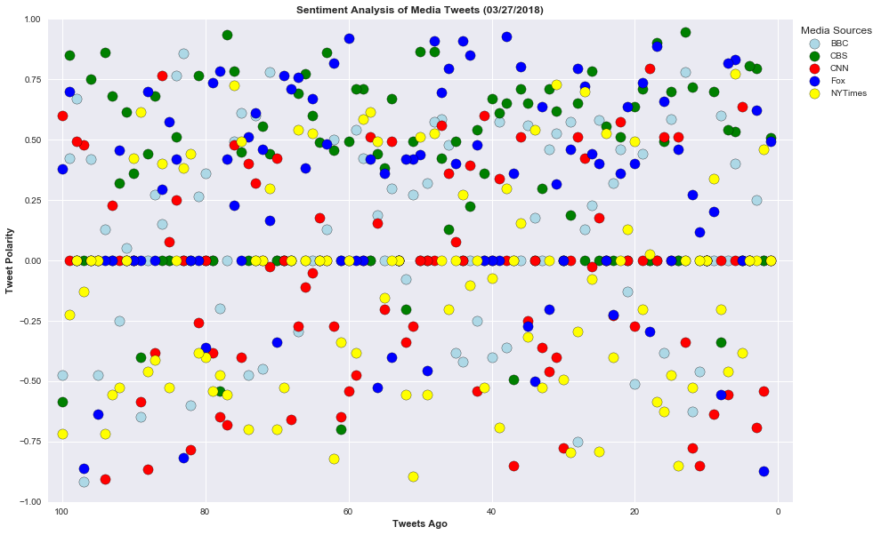

Distinguishing Sentiments

## News Mood

In this assignment, I created a Python script to perform a sentiment analysis of the Twitter activity of various news oulets, and to present your findings visually.

The final output provided a visualized summary of the sentiments expressed in Tweets sent out by the following news organizations: __BBC, CBS, CNN, Fox, and New York times__.

The first plot featured the following:

* Aa scatter plot of sentiments of the last __100__ tweets sent out by each news organization, ranging from -1.0 to 1.0, where a score of 0 expresses a neutral sentiment, -1 the most negative sentiment possible, and +1 the most positive sentiment possible.
* Each plot point reflects the _compound_ sentiment of a tweet.
* Each plot point is sorted by its relative timestamp.

The second plot is a bar plot visualizing the _overall_ sentiments of the last 100 tweets from each organization. For this plot, I aggregated the compound sentiments analyzed by VADER.

The tools included the following: tweepy, pandas, matplotlib, seaborn, textblob, and VADER.

The final Jupyter notebook:

* Pulled last 100 tweets from each outlet.
* Performed a sentiment analysis with the compound, positive, neutral, and negative scoring for each tweet. 
* Pulled into a DataFrame the tweet's source acount, its text, its date, and its compound, positive, neutral, and negative sentiment scores.
* Exported the data in the DataFrame into a CSV file.
* Saved PNG images for each plot.

As final considerations:

* Used the Matplotlib and Seaborn libraries.
* Included a written description of three observable trends based on the data. 
* Included proper labeling of your plots, including plot titles (with date of analysis) and axes labels.
