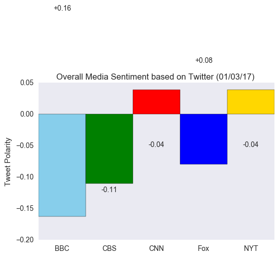

Distinguishing Sentiments

## News Mood

This application includes a Python script to perform a sentiment analysis of the Twitter activity of various news oulets, and to present your findings visually.

The final output provided a visualized summary of the sentiments expressed in Tweets sent out by the following news organizations: __BBC, CBS, CNN, Fox, and New York times__.

The first plot featured the following:

* A scatter plot of sentiments of the last __100__ tweets sent out by each news organization, ranging from -1.0 to 1.0, where a score of 0 expressing a neutral sentiment, -1 the expressing the most negative sentiment possible, and +1 the most positive sentiment possible.
* Each plot point reflects the _compound_ sentiment of a tweet.
* Each plot point is sorted by its relative timestamp.

The second plot is a bar plot visualizing the _overall_ sentiments of the last 100 tweets from each organization. For this plot, I aggregated the compound sentiments analyzed by VADER.

The tools included the following: tweepy, pandas, matplotlib, seaborn, textblob, and VADER.

The final Jupyter notebook contains:

* The last 100 tweets from each outlet.
* A sentiment analysis with the compound, positive, neutral, and negative scoring for each tweet. 
* A DataFrame with the tweet's source acount, its text, its date, and its compound, positive, neutral, and negative sentiment scores.
* The data in the DataFrame exported into a CSV file.
* Saved PNG images for each plot.

The application included the following:

* Matplotlib and Seaborn libraries.
* A written description of three observable trends based on the data. 
* Proper labeling of the plots, including plot titles (with date of analysis) and axes labels.
